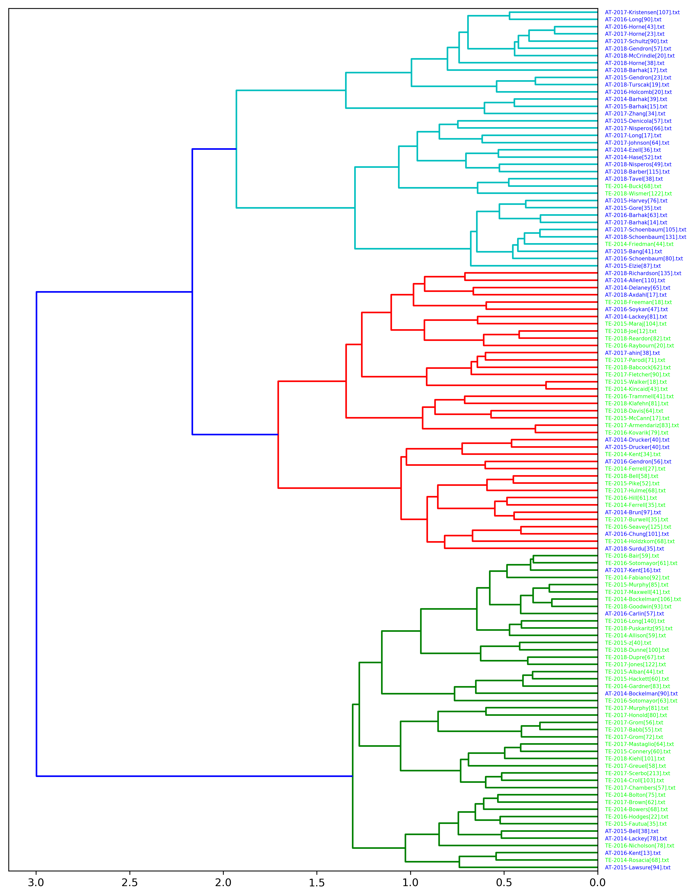

# The Paper

<h3 align="center">
  <strong>Word Has It: Text Analytics for Topic Modeling of MODSIM Track Papers</strong>
</h3>

<i>Authors: <a href="https://www.linkedin.com/in/jaygendron/">Jay Gendron</a></i>
  and 
  <i><a href="https://www.linkedin.com/in/gagemorgan/">Gage Morgan</a></i>

## Paper Link
_Proceedings of MODSIM World 2019_

## Abstract

Big data and data science are part of mainstream society, as evidenced by the many articles and social media posts presenting artificial intelligence and autonomous vehicles in diverse contexts. The volume and persistence of these topics show their rise in public interest. MODSIM launched the Analytics and Decision-Making Track in 2014 as recognition of the then burgeoning field of data science and the importance it would have on industry. This leadership decision continues today. On the fifth anniversary of the track, has the addition provided a body of work discernibly different from the simulation tracks?

This paper provides a five-year retrospective with an analysis of the papers published under the MODSIM Analytics and Decision-Making Track. It uses text analytics to investigate the content of the track with MODSIM papers from 2014 to 2018. After presenting a background of data science and current trends, the research question provides a foundation for data processing and analysis. The paper offers additional detail on the analytic techniques appropriate for unstructured text data followed by the specific results of these techniques. In this way, the paper not only provides measures of analytic content within MODSIM but also introduces readers to a look at the workflow underlying text analytics - a technique gaining more popularity since 2018. This paper closes with key findings that analytics tracks focused on contemporary issues in industry are value added to the MODSIM brand and these tracks will likely continue to attract papers and attendees.

_Keywords: big data, text analytics, machine learning, topic modeling, cluster analysis, MODSIM, data science, unstructured data, decision making, analytic workflow_

# The Data and Reproducible Code

The GitHub repository for this project contains data prepared for the analysis along with some code for ETL and visualization.

## Data

## Code

### ETL - Scraping metadata from MODSIM webpage

### ETL - Preparing datasets

### Analysis - Clustering

What happens by add
asdf
asdf
asdf
asdf
asdf
asdfasdf
asdf
asdf
asdf
asdf
asdf
asdf
asdf
asdf
asdf
asdf
asdf
asdf
asdf
asdf
asdf
asdf
asdfasdf
asdf
asdf
asdf
asdf
asdf
asdf
asdf
asdf
asdf
asdf
asdf
asdf
asdf
asdf
asdf
asdf
asdfasdf
asdf
asdf
asdf
asdf
asdf
asdf
asdf
asdf
asdf
asdf
asdf

wert
wertw
ertwert
wert
wertw
ertwert
wert
wertw
ertwert
wert
wertw
ertwert
wert
wertw

ertwert wert
wertw
ertwert
wert
wertw
ertwert
wert
wertw
ertwert
wert
wertw
ertwert
wert
wertw
ertwert
wert
wertw
ertwert
wert
wertw
ertwert
wert
wertw
ertwert
wert
wertw
ertwert
wert
wertw
ertwertertwert wert
wertw
ertwert
wert
wertw
ertwert
wert
wertw
ertwert
wert
wertw
ertwert
wert
wertw
ertwert
wert
wertw
ertwert
wert
wertw
ertwert
wert
wertw
ertwert
wert
wertw
ertwert
wert
wertw
ertwertertwert wert
wertw
ertwert
wert
wertw
ertwert
wert
wertw
ertwert
wert
wertw
ertwert
wert
wertw
ertwert
wert
wertw
ertwert
wert
wertw
ertwert
wert
wertw
ertwert
wert
wertw
ertwert
wert
wertw
ertwertertwert wert
wertw
ertwert
wert
wertw
ertwert
wert
wertw
ertwert
wert
wertw
ertwert
wert
wertw
ertwert
wert
wertw
ertwert
wert
wertw
ertwert
wert
wertw
ertwert
wert
wertw
ertwert
wert
wertw
ertwert

### Analysis - Topic Modeling

